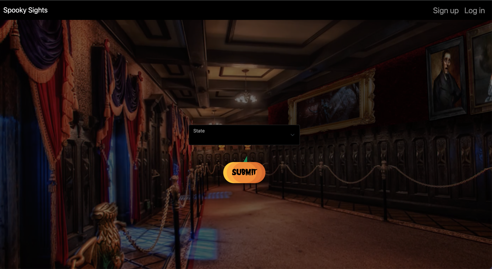
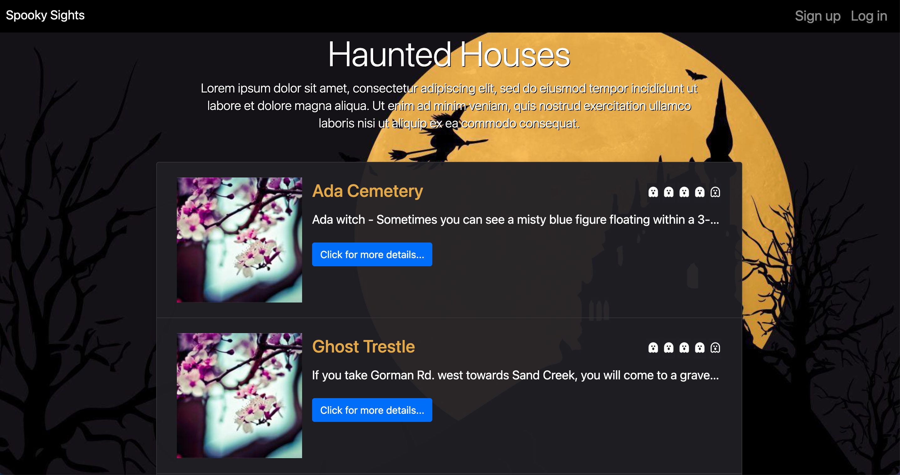
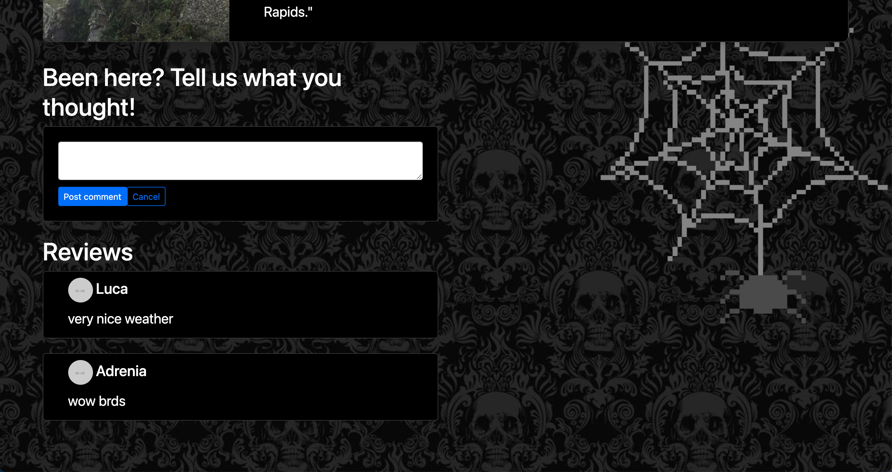

# COBWEB CODERS: SPOOKY SITES
  ## Table of Contents
  * [Description](#description)
  * [Installation](#installation)
  * [Usage](#usage)
  * [License](#license)
  * [Contributors](#contributors)
  * [Questions](#questions)

  ## Description
Welcome to Spooky Sites, made by the Cobweb Coders! This application allows you to view the spooky sites in your local area. This is a full-stack application that is deployed on Heroku and uses the MVC paradigm, our own server-side API, has user authentication, and connects to a database.

  ## Installation 
  To install necessary dependancies, run the following command:
  
  npm i
The application is deployed on Heroku, so you can follow the link mentioned below.

  ## Usage 
  The application uses NodeJS, OOPS concepts, SQL, ORM and MVC paradigms. The application's front-end is created using handlebars.js.

## License
  This project is licensed under the MIT license.
  
  
  
  [License]((https://opensource.org/licenses/MIT)

  ## Contributors
  The entire team of cobweb coders contributed to the development of SPOOKY SITES!

  ## Deployed Application

You can view the deployed application on Heroku:
<https://spooky-sights.herokuapp.com/homepage>

Here are some screenshots for the application:

  ## Questions
  Contact us:
  If you have any questions about the repo, please open an issue on our GitHub repo.
<https://github.com/vcapella/Cobweb-coders>

- - -
© 2021 Cobweb Coders Technologies. All Rights Reserved.
